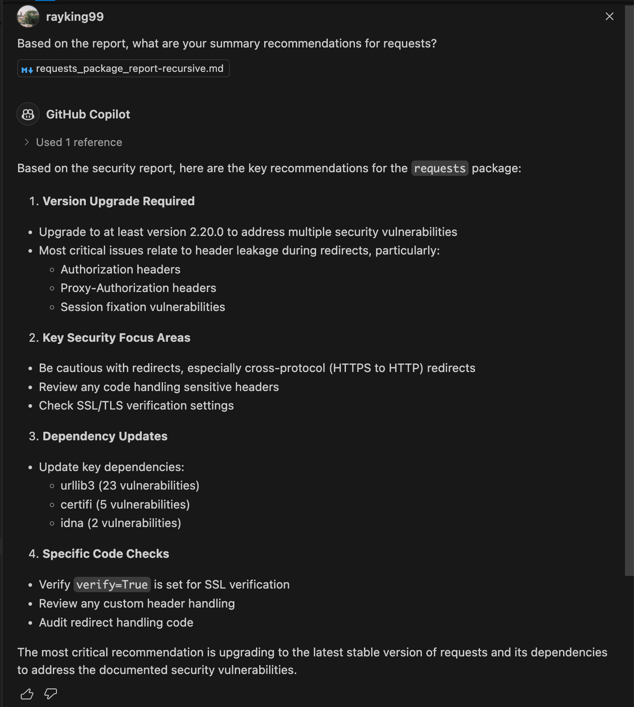

# BETTERCHECK

Better than nothing.

## What is it?

A CLI tool that helps evaluate Python packages for security concerns before installing them. Performs checks against multiple vulnerability databases and provides useful metrics about package health, including **recursive supply-chain analysis** with contributor statistics and visualizations.

## Quick Start

```bash
# Install with UV (recommended)
uv add bettercheck

# Or with pip
pip install bettercheck

# View available commands and options
bettercheck --help  

# Main security/package analysis command
bettercheck <package_name> [--json] [--debug] [--report {txt,md}] [--with-deps]
# For example
bettercheck pandas --report md --with-deps
# Also possible - but with mixed results 
bettercheck package-name --github-url https://github.com/owner/repo

# Check bettercheck project dependencies
bettercheck-yourself [--direct-only]

# Analyze dependency tree
bettercheck-deps <package_name>
bettercheck-deps pandas 

# NEW: Recursive supply-chain analysis with visualizations
bettercheck-recursive <package_name> [--max-depth 3] [--format md] [--no-contributors]
bettercheck-recursive flask --max-depth 2 --format md
```

## New: Recursive Supply-Chain Analysis

The `bettercheck-recursive` command provides comprehensive analysis of your entire dependency tree:

### Features

- 🔍 **Deep Dependency Analysis**: Recursively analyze all packages in the supply chain
- 👥 **Contributor Statistics**: Track who maintains your dependencies
- 📊 **Visualizations**: Generate charts showing vulnerabilities, contributors, and dependency distribution
- 📝 **Comprehensive Reports**: Export as Markdown or JSON

### Example Usage

```bash
# Full recursive analysis with all features
bettercheck-recursive flask --max-depth 3 --format md

# JSON output for programmatic processing
bettercheck-recursive django --format json --output ./reports

# Skip contributor stats for faster analysis
bettercheck-recursive requests --no-contributors
```

### Sample Output

```
🔍 Starting recursive supply chain analysis for flask
   Max depth: 3
   Include contributors: True

  Analyzing flask (depth 0)...
  Analyzing werkzeug (depth 1)...
  Analyzing markupsafe (depth 2)...
  Analyzing jinja2 (depth 1)...
  Analyzing click (depth 1)...
  Analyzing itsdangerous (depth 1)...
  Analyzing blinker (depth 1)...

📊 Analysis Complete!
   Packages analyzed: 7
   Total vulnerabilities: 12

📄 Report saved to: reports/supply_chain_flask_20241210_123456.md
```

### Generated Report Contents

The generated report includes:

1. **Summary Statistics**
   - Total packages analyzed
   - Total vulnerabilities found
   - Packages with vulnerabilities
   - Total contributors across supply chain

2. **Dependency Tree (ASCII visualization)**
   ```
   └── flask (2.3.0)
       ├── werkzeug (2.3.6) ⚠️ 2 vulns
       │   └── markupsafe (2.1.3)
       ├── jinja2 (3.1.2)
       │   └── markupsafe (2.1.3)
       ├── click (8.1.7)
       ├── itsdangerous (2.1.2)
       └── blinker (1.6.2)
   ```

3. **Visualizations (PNG charts)**
   - Vulnerabilities by package (bar chart)
   - Dependency distribution by depth (pie chart)  
   - Top contributors across supply chain (bar chart)

4. **Vulnerability Details**
   - CVE/GHSA identifiers
   - Severity levels
   - Advisory descriptions

5. **Contributor Statistics**
   - Total contributors per package
   - Top contributors with contribution counts

### Python API

```python
from bettercheck.recursive import run_recursive_analysis
import asyncio

async def analyze():
    report_path = await run_recursive_analysis(
        package_name="flask",
        max_depth=3,
        include_contributors=True,
        output_format="md",
        output_dir="./reports"
    )
    print(f"Report generated: {report_path}")

asyncio.run(analyze())
```


### bettercheck Analysis of bettercheck
```sh
(.venv) % bettercheck-yourself

Analyzing requests...

Analyzing click...

Analyzing packaging...

Analyzing pygithub...

Analyzing pypistats...

Analyzing jsonschema...

Analyzing aiohttp...

Analyzing dataclasses...

Report saved to: ./reports/bettercheck-20241210_170638.json

=== Dependencies Security Analysis ===

Total packages analyzed: 8
Total vulnerabilities found: 33


requests:
-------------------
Version: 2.32.3
Monthly downloads: 580,975,452
Vulnerabilities: 11
- [OSV] GHSA-652x-xj99-gmcc
- [OSV] GHSA-9wx4-h78v-vm56
- [OSV] GHSA-cfj3-7x9c-4p3h
- [OSV] GHSA-j8r2-6x86-q33q
- [OSV] GHSA-pg2w-x9wp-vw92
- [OSV] GHSA-x84v-xcm2-53pg
- [OSV] PYSEC-2014-13
- [OSV] PYSEC-2014-14
- [OSV] PYSEC-2015-17
- [OSV] PYSEC-2018-28
- [OSV] PYSEC-2023-74

GitHub Metrics:
Stars: 52,266
Forks: 9,339
Open Issues: 254
Last Update: 2024-11-10 16:18:37+00:00

click:
-------------------
Version: 8.1.7
Monthly downloads: 259,210,862
No known vulnerabilities

GitHub Metrics:
Stars: 15,848
Forks: 1,405
Open Issues: 104
Last Update: 2024-12-07 20:10:36+00:00

packaging:
-------------------
Version: 24.2
Monthly downloads: 513,411,357
No known vulnerabilities

GitHub Metrics:
Stars: 628
Forks: 251
Open Issues: 104
Last Update: 2024-12-01 15:33:46+00:00

pygithub:
-------------------
Version: 2.5.0
Monthly downloads: 35,947,481
No known vulnerabilities

GitHub Metrics:
Stars: 7,072
Forks: 1,792
Open Issues: 354
Last Update: 2024-12-04 08:56:01+00:00

pypistats:
-------------------
Version: 1.7.0
Monthly downloads: 26,193
No known vulnerabilities

GitHub Metrics:
Stars: 200
Forks: 28
Open Issues: 9
Last Update: 2024-12-08 11:29:21+00:00

jsonschema:
-------------------
Version: 4.23.0
Monthly downloads: 183,583,243
No known vulnerabilities

GitHub Metrics:
Stars: 4,643
Forks: 582
Open Issues: 38
Last Update: 2024-12-09 19:57:02+00:00

aiohttp:
-------------------
Version: 3.11.10
Monthly downloads: 209,496,974
Vulnerabilities: 22
- [OSV] GHSA-27mf-ghqm-j3j8
- [OSV] GHSA-45c4-8wx5-qw6w
- [OSV] GHSA-5h86-8mv2-jq9f
- [OSV] GHSA-5m98-qgg9-wh84
- [OSV] GHSA-7gpw-8wmc-pm8g
- [OSV] GHSA-8495-4g3g-x7pr
- [OSV] GHSA-8qpw-xqxj-h4r2
- [OSV] GHSA-gfw2-4jvh-wgfg
- [OSV] GHSA-jwhx-xcg6-8xhj
- [OSV] GHSA-pjjw-qhg8-p2p9
- [OSV] GHSA-q3qx-c6g2-7pw2
- [OSV] GHSA-qvrw-v9rv-5rjx
- [OSV] GHSA-v6wp-4m6f-gcjg
- [OSV] GHSA-xx9p-xxvh-7g8j
- [OSV] PYSEC-2021-76
- [OSV] PYSEC-2023-120
- [OSV] PYSEC-2023-246
- [OSV] PYSEC-2023-247
- [OSV] PYSEC-2023-250
- [OSV] PYSEC-2023-251
- [OSV] PYSEC-2024-24
- [OSV] PYSEC-2024-26

GitHub Metrics:
Stars: 15,204
Forks: 2,027
Open Issues: 249
Last Update: 2024-12-09 20:12:28+00:00

dataclasses:
-------------------
Version: 0.8
Monthly downloads: 18,805,604
No known vulnerabilities

GitHub Metrics:
Stars: 586
Forks: 53
Open Issues: 8
Last Update: 2024-07-11 16:14:35+00:00
```

Full report: [bettercheck-yourself.json](bettercheck-yourself.json)

## Installation

### Using UV (Recommended)

[UV](https://docs.astral.sh/uv/) is a fast Python package manager. Install it first, then:

```bash
# Clone and install with UV
git clone https://github.com/rayking99/bettercheck
cd bettercheck
uv sync

# Or install from PyPI
uv add bettercheck
```

### Using pip

```bash
pip install bettercheck 

# or for development
git clone https://github.com/rayking99/bettercheck
cd bettercheck
pip install -e .
```

## Usage

To get the commands automatically, you can run:
```bash
# View available commands and options
python -m bettercheck --help  
python -m bettercheck.check_yourself --help
python -m bettercheck.recursive --help

# Example usage - check a package
python -m bettercheck requests --json
python -m bettercheck pandas --report md --with-deps
python -m bettercheck flask --debug

# Check this project
python -m bettercheck.check_yourself
python -m bettercheck.check_yourself --direct-only

# Recursive supply-chain analysis
python -m bettercheck.recursive flask --max-depth 2
```


There is also a single file / directory scanner that looks for common vulnerabilities. Obviously there are some ways to scan this code in a safe environment. 

```bash
# Security scan for Python files/directories
bettercheck-scan scan-file <file_path> [-o OUTPUT_DIR]
bettercheck-scan scan-dir <directory>
```

### Usage Within Python File

#### 1. Simple Package Check
```python
from bettercheck.checker import PackageChecker
import asyncio

async def check_package():
    checker = PackageChecker("requests")
    security_info = await checker.check_security()
    
    if security_info:
        print(f"Found {len(security_info)} vulnerabilities")
        for vuln in security_info:
            print(f"- {vuln['vulnerability_id']}: {vuln['advisory']}")
    else:
        print("No vulnerabilities found")

asyncio.run(check_package())
```

#### 2. Check Package with Dependencies
```python
from bettercheck.dep_tree import analyze_deps
import asyncio

async def check_with_deps():
    # Analyze dependencies up to 2 levels deep
    deps = await analyze_deps("flask", max_depth=2)
    
    print(f"Package: {deps['name']} v{deps['version']}")
    for dep in deps.get('requires', []):
        print(f"└── {dep['name']} v{dep['version']}")

asyncio.run(check_with_deps())
```

#### 3. Generate Security Report
```python
from bettercheck.package_report import PackageReport
import asyncio

async def generate_report():
    report = PackageReport("django")
    data = await report.generate_single_report()
    
    # Save as both JSON and Markdown
    json_path = report.save_report(data, "json")
    md_path = report.save_report(data, "md")
    
    print(f"Reports saved to: {json_path}, {md_path}")

asyncio.run(generate_report())
```

#### 4. Recursive Supply-Chain Analysis
```python
from bettercheck.recursive import run_recursive_analysis, RecursiveAnalyzer
import asyncio

# Quick analysis
async def quick_analysis():
    report_path = await run_recursive_analysis(
        package_name="requests",
        max_depth=2,
        include_contributors=True,
        output_format="md"
    )
    print(f"Report saved to: {report_path}")

asyncio.run(quick_analysis())

# Or use the analyzer directly for more control
async def detailed_analysis():
    analyzer = RecursiveAnalyzer(max_depth=3, include_contributors=True)
    results = await analyzer.analyze("flask")
    
    # Access results programmatically
    for pkg_name, pkg_data in results.items():
        print(f"{pkg_name}: {len(pkg_data.security_info)} vulnerabilities")
        if pkg_data.contributor_stats:
            print(f"  Contributors: {pkg_data.contributor_stats.total_contributors}")

asyncio.run(detailed_analysis())
```

#### 5. Generate Visualizations
```python
from bettercheck.recursive import RecursiveAnalyzer, SupplyChainVisualizer
from pathlib import Path
import asyncio

async def generate_charts():
    # Analyze package
    analyzer = RecursiveAnalyzer(max_depth=2)
    results = await analyzer.analyze("django")
    
    # Create visualizer
    visualizer = SupplyChainVisualizer(results, analyzer.dependency_graph)
    
    # Generate ASCII tree
    print(visualizer.generate_dependency_tree_ascii("django"))
    
    # Generate charts
    output_dir = Path("charts")
    output_dir.mkdir(exist_ok=True)
    
    visualizer.generate_vulnerability_chart(output_dir / "vulns.png")
    visualizer.generate_contributor_chart(output_dir / "contributors.png")
    visualizer.generate_depth_distribution_chart(output_dir / "depth.png")

asyncio.run(generate_charts())
```

## Development

### Installation with UV (Recommended)
```bash
git clone https://github.com/rayking99/bettercheck
cd bettercheck
uv sync --all-extras
```

### Installation with pip
```bash
git clone https://github.com/rayking99/bettercheck
cd bettercheck
pip install -e ".[dev]"
```

### Testing
```bash
# Run tests with UV
uv run pytest

# Or with pytest directly
pytest

# Run style checks
uv run ruff check .
uv run black --check .
```

### Platform Support
Supported on:

Linux
macOS
Windows


### Potential Extensions

`Examples/package_report.py` can create package reports that include studies on dependencies. [requests report](Examples/requests_package_report-recursive.md)

Passing this information through to Claude - we get: 




## Features

- 🔐 **Vulnerability Scanning**: Check packages against OSV and CVE databases
- 📊 **Package Statistics**: View download stats and package health metrics
- 🐙 **GitHub Metrics**: Stars, forks, issues, and activity data
- 📝 **Report Generation**: Export findings as Markdown, JSON, or text
- 🔍 **Detailed Advisories**: Full vulnerability descriptions and remediation advice
- 🌳 **Dependency Analysis**: Map out your dependency tree
- 🔄 **Recursive Supply-Chain Analysis**: Analyze your entire dependency graph
- 👥 **Contributor Statistics**: Track who maintains your dependencies
- 📈 **Visualizations**: Generate charts for vulnerabilities, contributors, and dependency depth

## License

MIT

## Roadmap

- ~~Recursive check to encompass entire supply-chain (including contributors stats) + visualisations~~ ✅ Completed!
- Various tools to help understand open-source software development and dependencies
- Integration with additional vulnerability databases
- Automated security policy recommendations

## Disclaimer

This is only a research tool. 

## Acknowledgements

This idea started with the video: Russ Cox at ACM SCORED: Open Source Supply Chain Security at Google [YouTube Video](https://www.youtube.com/watch?v=6H-V-0oQvCA)

Claude, Gemini, Llama and o1 all made contributions with the scope, code and understanding.